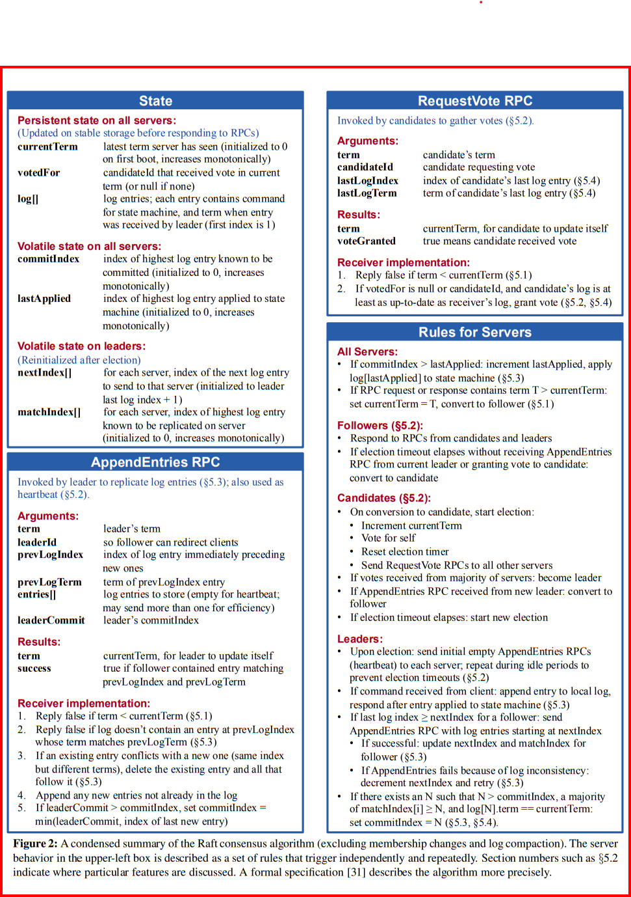

#### Ensure the project builds

```shell
go build
```

#### Ensure the k/v db builds

```shell
cd kvapi
go build
```

> **Note:**
> <br> should see a file called kvapi.exe (on windows) if successfully built
> <br> before starting the server ensure to cleanup previous *.dat files using `rm *.dat` in the '<project root>/kvapi' directory.

#### Start the server in 3 terminals

```shell
./kvapi --node 0 --http :2020 --cluster "0,:3030;1,:3031;2,:3032"
./kvapi --node 1 --http :2020 --cluster "0,:3030;1,:3031;2,:3032"
./kvapi --node 2 --http :2020 --cluster "0,:3030;1,:3031;2,:3032"
```

#### Query the k/v db

```shell
curl "http://localhost:2020/set?key=x&value=hello"
```

>**Note:**
> <br> if the curl request fails, then retry another server port as the request has to go to the leader for it to be processed

---

